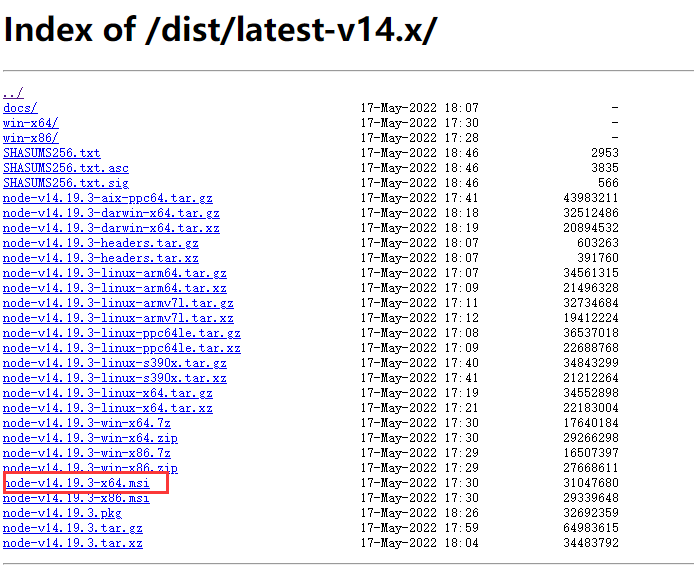
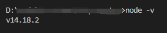
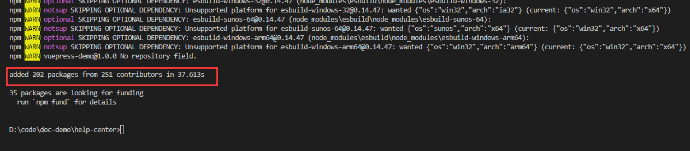
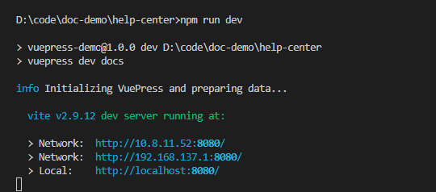

# 快速上手

本节将介绍如何快速上手使用和维护该组件文档。

## 🎨环境安装

### 1、安装Node.js

下载地址：[https://nodejs.org/dist/latest-v14.x/](https://nodejs.org/dist/latest-v14.x/)，选择64位msi格式的安装。

:::warning 注意事项

- vuepress v1.x 需要Node.js版本 `>= v14` 
- vuepress v2.x 需要Node.js版本 `>= v8.6`

:::



一路确定，即可安装完成。

:::tip 如何检测是否安装成功？

安装完成后，打开控制台，输入`node -v`，显示如下截图即表示安装成功。



:::


### 2、安装组件文档运行的依赖包

在项目 **根目录（也就是和docs同级目录下）** 下，输入下面指令，即可安装。

```
npm i
```

如下截图显示表示安装成功：



## 🌐运行项目查看效果

还是在项目**根目录**，输入下面指令，即可启动项目预览。

```
npm run dev
```



我们使用`ctrl+鼠标左键`，点击任意一个链接，即可打开浏览器显示该项目预览界面。

## 🔨工具推荐

:::tip 工具推荐
- 推荐使用 [Typora](https://typoraio.cn/) 编辑器（或者 [VSCode](https://code.visualstudio.com/)），提供所见即所得的markdown的编辑体验。
- markdown参考文档：
  - [Markdown 官方教程](https://markdown.com.cn/)
  - [Markdown 基本语法](https://www.markdown.xyz/basic-syntax/)


:::


## ✍文档编写

要显示一个文档，最简单的只需要3步：

1、在`guide`文件夹下新增一个markdown文件（比如`test.md`）。

> 跟`.vuepress`同级的任何地方均可，只需要在后面配置目录的时候把路径写对即可。

2、用markdown格式写文档。

> 注意只能有一个一级标题，这个一级标题会自动作为该文档的标题，并显示在左侧目录中

3、设置 `docs/.vuepress/config.js`文件，在sidebar中添加该文件路径，即可让其显示在左侧目录中。

```js
sidebar: [
  '/guide/test.md',
]
```

4、保存，搞定！剩下的只需要把刚才的`test.md`文件补充完整即可。

> 你会发现左侧目录会自动增加一个刚才一级标题的目录。


## 🎊网站发布

所有的文档写完后，就可以部署到服务器，让任何人都可以访问了。

### 1、生成需要发布的文件

在项目根目录下，打开控制台，执行下面指令：

```
npm run build
```

执行后，会在`.vuepress` 目录下生成一个`dist`目录，这个目录下的文件就是我们待发布的所有内容。

### 2、发布到网站

我们只需要把这个目录发给相关部署的人员帮我们部署，或者自己把该目录部署到服务器。

over. 🎉🎉🎉